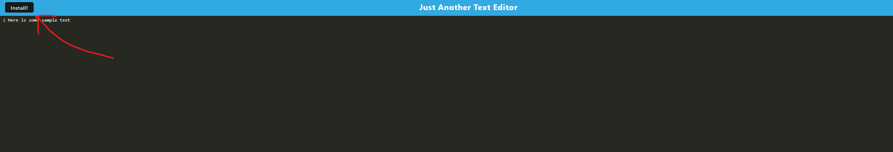
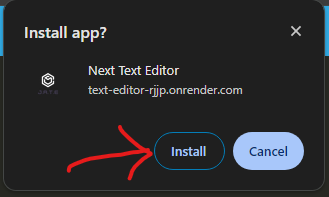

# <Next_Text_Editor>

## Description

The next text editor is another text editor that you can download as a PWA

## Table of Contents

- [Usage](#usage)
- [Credits](#credits)
- [License](#license)

## Usage

To use the app you simply have to go to the link at the bottom and it will present you with the webapp. if you want to be able to use it offline you just have to click the download app prompt that appears at the top of the page

then you will be prompted to confirm the installation

you are ready to use the next text editor

## Credits

start code was cloned from msu coding bootcamp

## Links

here is a link to the deployed app on render https://text-editor-rjjp.onrender.com/

here is a github link to the repository https://github.com/Jgarnaat/next-text-editor

